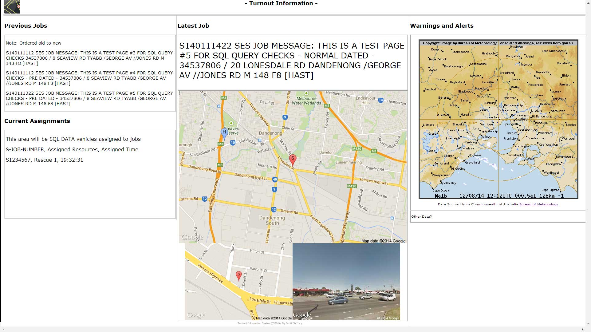

# ITS
Incident Turnout System (SES/CFA)

This is the Incident Turnout System I developed around somewhere around 2014 through to 2018 and was deployed and used for around a year in the Greater Dandenong SES unit.

## What is an Incident Turnout System?
Depending who you ask, an incident turnout system aggregates Requests For Assistance (RFA)'s whic come in the form of pager messages sent to a unit or brigade, and displays those messages in a meaningful way to plan, prepare and or otherwise assistance in the emergency response of those incidents.

Additional functionality may exist and these can often be modular.
A good Incident Turnout System will provide a noticeboard style presentation of incoming and outstanding RFA's and specific warning and alerts that would assist the rescue operators in their duties.

## What did this Incident Turnout System do?
This Incident Turnout System had a number of features in it's complete stack:

1. A main display showing;
- The last incoming RFA or informational message
- The previous few RFA/messages
- Beuro of Meterology radar and doppler wind (alternating screen) realtime monitoring, and 
- Google map road/cross-street view and Google Map street view when available
- Google map pins for HQ (unit location), RFA location

2. Optional customisable audible alert for inbound RFA with;
- Text to speech: read out full alert / Or
- Text to speech: Read out RFA type and RFA # (eg, "New Job, Sierra 2-0-3-0-4-0-1..." (et al))
- Custom combination with own code

3. Optional automated printed RFA/Job sheet;
- Customised job sheet suited for SES
- Easily customiseable template (which included plain text (default) and HTML)
- Pre-filled job sheet with each job detail discernable from the original page message (ie, names, phone, street address, job type etc)

(V1.1 testing site / Concept screenshot. It was slightly updated from this)

In simple terms, as the pager recieves a message that reported a storm or rescue event applicable to your unit, the pager message would be filtered and displayed on the ITS screen, at the same time if enabled, an audible speaking voice would alert you to the new RFA and the printer would automatically print out a job sheet that can be handed to a crew. This all happened in real time within 1-2 second delay for the printjob depending on the equipment speeds invovled.

## What was the benefit / Why create it?
When there is only one incident to respond to, there is very little need for this system. But when it rains it pours, especially in SES context during storm events, and for CFA during bushfire season.

A pager only holds 99 messages at any given time and will then overwrite older messages regardless of being read. Further to this, as you would be reading one message, if another comes in, it would be marked as read and the new messages list is displayed. This means that you cant sucessfully read a message when the pager goes off every few seconds, and yes, it does. When this happens, the pager is utterly useless and SES/CFA need to switch to computer listings in order to be able to read the details coming in.

This is true for 'busy' times where there can be one or two jobs every 5-10 minutes, as well as when there is a "meltdown" of messages coming through the system.

The other main benefits are the mapping. Knowing instantly where the RFA is located on a map, gives immediate context to its location, such as being near a major known road or location, makes navigation easier, especially when crews can be limited in number / resources thin, it aides in navigation.
The street view also gives rescue workers immediate knowledge such as "there is a big tree there" or "that is a two story house, we need the truck with the two story ladder for this job", certain details that would otherwise not be communicated via pager message.

At the time at least - and probably still now, the mandatory paperwork which is completed either online or via a specified form, is such that it can be cumbersome to fill out and has a number of required items that are spread across two or more pages. The pre-printed job sheet enabled collection of the required data for most jobs on a single sheet so that the crew could spend less time filling out paperwork out in the field, but still capture the required information to fill out the paperwork directly online, vs the double handling of paper to online which happened afterwards. This was a huge time saver with pre-fill info as well as the time saved from double handling. - it was also a lot easier to fill out in a moving truck!

## What happened to this project? Is there anything else out there?
I left the SES because of _reasons_ (such as but not limited to https://www.theage.com.au/national/victoria/ses-members-report-widespread-bullying-harassment-and-rape-allegation-20210808-p58gwi.html). I stopped any and all development on this, despite having all of necessery equipment to continue.

I provided a copy to a SES/CFA member, who probably (read- absolutely would have) shared it with others. Now a few years later, I have heard of a few different iterations and similar projects come out, but have not had involvement with them. A friend recently sent me a screenshot with one called "PagerMon" so that is a good place to start. It likely uses the same stack, but does not appear to have the same functionality.

I developed the ITS around the time that BART (broadcast alert response technology) was being developed. At that time it consistented of a phone app with push notification, and it was awesome. ITS was different. Shortly after, I recall speaking with a dev of BART and/or posting in a forum about ITS and a few months later the desktop application for BART was launched, and it was also awesome. Again, it was still not ITS in terms of the voice or print functionality which was something that our unit and members liked.

I also briefly consulted with a regional CFA member on a VBA application he was developing and contributed a few fixes, if I ever recall those detials or find the code in my archives, I will update this.

## The stack (aka requirements) for ITS (and any others out there)
In order to get messages from the pager network, assuming you do not have direct access to the data (like BART was able to do), then you need non-discriminated audio feed of the pager frequency to be fed into a computer and the software to decode it.

1. A LAMP/WAMP  (Linux/Windows Apache Mysql PHP) - This is for the web service for the ITS display and does not need to be the same physical machine.
2. A software defined radio SDR (typically USB rtl-sdr)
3. A capable tuneable SDR reciever software, (read: SDR# / SDR Sharp)
4. PDW (Windows only) - PDW is the ONLY program that I know of that can actually decode pager messages and filter and run scripts on filters (required)
5. Virtual audio cable / multiple sound cards / Audio solution to suit - The output of the audio signal of SDR# is fed into the audio line-in input for the PDW machine
6. (Optional) speakers on PDW machine (or house PA system whatever!)
7. (optional) printer(s) installed on PDW machine (network or local)

## Some notes on setup
I originally had scripted installs for this, but if they are not in this repo, it means that I didnt feel like digging through my archives, or storage shed for the original hardware that still has it. If it is there - consider it a bonus!

The SDR radio must be calibrated, which an FM radio station aids in this. Tune to an known FM radio station, then adjust SDR#'s offset until the tuned frequency matches the station frequency. Calibrations are good only after an hour of 'burn in' on the dongle. Then its true and bankable. (unless you change aerials)

You can use a standard VHF/UHF TV aerial mounted on the roof with the SDR# - but your results may vary. Some SDR dongles are better than others. Some have PAL connectors on them, some dont.

Turn the pager over, the frequency you need is written on it. Tune to it exactly and wait. Test, calibration and pager update signals are sent very often. CFA and SES share the same network. Ambulence, hospitals and private security etc are in neighboring frequencies.

SDR# and PDW are typically set to auto launch and start.. doing this on a windows platform is difficult, sure you can auto-launch but SDR# (at that time at least) ahd no auto start functions. I wrote a VBA script that litterally alt tab and arrowed up and hit space etc to initiate user-operated initiation. These scripts were 99% perfect but they fell down when some stupid windows alert or software prompt randomly appears. Obviously thats rare and you dont turn it off unless you have to. It was good enough, but not sellable.

PDW must be fully setup to allow for filtering and job captures, whilst including or excluding "administrative" messages, tests and non RFA related content, unless you want it. All of this would be easy enough with my filters, but without them...
Each RFA came through with the first two characters being a pager code to denote the type of incident.

@@ = Emergency

Hb = Non-Emergency

QD = Admin Page

The structure was always the same, which included <time> <date> then encoding etc, followed by the incident number, the message and the signoff included "[UNIT]" where UNIT = the abbreviation of your unit or brigade. It is by this simplicity that with the correct use of regular expressions etc, that names, addresses and phone numbers can easily be extracted from the message. Monitoring another unit if you are performing relieving duties etc, requried no more than to add additional copied filters into PDA and change the unit identifier.

Let's be clear, it is PDW that does the bulk of the work. PDW calls batch scripts which invoke dynamic VBA and SQL insert scripts. This is why Windows is requried, but it can be any windows machine. By keeping to batch scripts, this was capable of being able to be run on state controlled SES/CFA domained computers (at the time at least), or any other air-gapped windows machine. You may instictively think to change all this, because batch/bash scripts arent cool, and that is totally fine. But each process ran, without question, without wavier, without updates and security and other issues. It was as set and forget as possible, whilst also being easy to read/understand. Nevertheless, PDW was also limited to batch scripts, so you would still need to invoke your alternative script (python?) via batch.

Visual runtimes were also required, and as we know, after a few years either code has to change or older runtimes need to be installed. This is perhaps something that may require some re-work, that said - the VBS scripts are using tried and tested methods, so fingers crossed..
  
In terms of hardware, I was able to run the ITS stack entirely on a Core 2 Duo with 4-8GB RAM (shared video) with a NAS for the db server. You would greatly benefit from a quad-core or better and if you have a high volume, a dedicated db server. A UPS is essential.
  
## Note on legalities
I recall spending a bit of time investing and asking questions on the legalities of using such a system. Others are looking at push notifications, telegram and other socials integrations. This is all possible with my ITS, but this was never something that was legally permissible.

It is also something that one has to consider if they want to have ongoing support; if you are looking at running this, then you are likely a volunteer, so considering how much time I spent creating this stack, testing it, re-working it, I wouldnt want to commit to something that could lead you to spending a few hours a week baby sitting, moreover would run you afoul of a few Acts. Get written permission by your organisations head-office and C-Y-A before you even contemplate storing the data outside of your unit (ie on amazon hosting, or at home)
  
Remember, the data contains Personal identifiable information in the RFA's and storing that data outside of, or in perpetuity outside of the purpose of the response, or "republishing" that information via another medium is where you may fall down legally. So keep it in-house and it's all good.

## Why release this now?
I was not active on github at the time and I hadnt built up enough interest outside of my local area for the program. I considered it unfinished and unpolished and still do. There were a lot more things I wanted to do, including testing the viability of an installable Windows exe, which never happened.
  
I was recently messaged by a friend from my old unit who mentioned "PagerMon" and it reminded me of all this work I had done. I felt that I should share it with the community and perhaps some of the features that I implemented may find their way back into use (if they have not already done so).

If my code/concept/design is at all useful, I wouldnt mind some attribution, or to hear how it is useful. 
